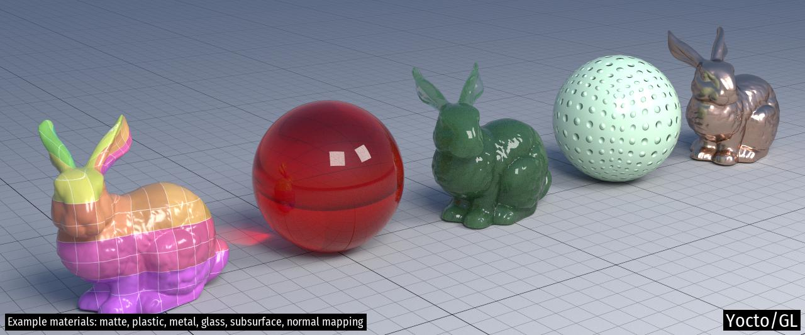
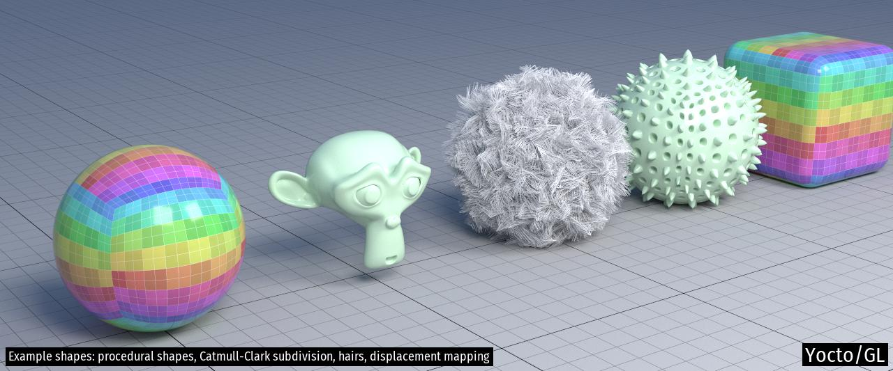

# Yocto/GL: Tiny C++ Libraries for Data-Oriented Physically-based Graphics

Yocto/GL is a collection of small C++17 libraries for building
physically-based graphics algorithms released under the MIT license.
Yocto/GL is written in a deliberately data-oriented style for ease of
development and use.
Yocto/GL is split into small libraries to make code navigation easier.
See each header file for documentation.

- `yocto/yocto_math.{h}`: fixed-size vectors, matrices, rigid frames,
  transforms
- `yocto/yocto_color.{h}`: color conversion, color adjustment,
  tone mapping functions, color grading, color maps, color spaces
- `yocto/yocto_geometry.{h}`: rays, bounding boxes,
  geometry functions, ray-primitive intersection, point-primitive overlap
- `yocto/yocto_noise.{h}`: Perlin noise
- `yocto/yocto_sampling.{h}`: random number generation, generation of points
  and directions, Monte Carlo utilities
- `yocto/yocto_shading.{h}`: evaluation and sampling of fresnel
  functions, bsdf lobes, transmittance lobes, phase functions
- `yocto/yocto_image.{h,cpp}`: simple image data type, image resizing,
  tonemapping, color correction, procedural images, procedural sun-sky
- `yocto/yocto_shape.{h,cpp}`: simple shape data structure, utilities 
  for manipulating triangle meshes, quads meshes and line sets, computation of 
  normals and tangents, linear and Catmull-Clark subdivision, 
  procedural shapes generation, ray intersection and closest point queries
- `yocto/yocto_mesh.{h,cpp}`: computational geometry utilities for
  triangle meshes, mesh geodesic, mesh cutting
- `yocto/yocto_scene.{h,cpp}`: scene representation and properties
  evaluation
- `yocto/yocto_bvh.{h,cpp}`: ray intersection and closest point queries
  of triangle meshes, quads meshes, line sets and instances scenes using a
  two-level bounding volume hierarchy
- `yocto/yocto_trace.{h,cpp}`: path tracing of surfaces and hairs supporting
  area and environment illumination, microfacet GGX and subsurface scattering,
  multiple importance sampling
- `yocto/yocto_cli.{h,cpp}`: printing utilities and command line parsing
- `yocto/yocto_sceneio.{h,cpp}`: image, shape and scene serialization
- `yocto/yocto_modelio.{h,cpp}`: low-level parsing and writing for 
  Ply, Obj, Stl, Pbrt formats
- `yocto/yocto_parallel.h`: concurrency utilities
- `yocto/yocto_json.{h,cpp}`: Json data model and serialization (deprecated)

You can see Yocto/GL in action in the following applications written to
test the library:

- `apps/yscene.cpp`: command-line scene manipulation and rendering, and interactive viewing
- `apps/yshape.cpp`: command-line shape manipulation and rendering, and interactive viewing
- `apps/yimage.cpp`: command-line image manipulation, and interactive viewing

Here are some test images rendered with the path tracer. More images are
included in the [project site](https://xelatihy.github.io/yocto-gl/).

## Design Considerations

Yocto/GL follows a "data-oriented programming model" that makes data explicit.
Data is stored in simple structs and accessed with free functions or directly.
All data is public, so we make no attempt at encapsulation.
We do this since this makes Yocto/GL easier to extend and quicker to learn,
with a more explicit data flow that is easier when writing parallel code.
Since Yocto/GL is mainly used for research and teaching,
explicit data is both more hackable and easier to understand.

Nearly all objects in Yocto/GL have value semantic. This means that everything
can be trivially copied and serialized and there is no need for memory management. 
While this has the drawback of potentially introducing spurious copies, it does
have the benefit of ensuring that no memory corruption can occur, which
turned out was a major issue for novice C++ users, even in a very small
library like this one. 

In terms of code style we prefer a functional approach rather than an
object oriented one, favoring free functions to class methods. All functions
and data are defined in the `yocto` namespace so libraries can call each others
trivially.

The use of templates in Yocto was the reason for many refactoring, going
from no template to heavy template use. At this point, Yocto uses some templates
for readability. In the future, we will increase the use of templates in math
code, while keeping many APIs explicitly typed.

For error handling in IO we either return status object or an interface that
uses boolean flags and error strings. Internally exceptions are used when used
by external libraries, but otherwise no exception are used. At the moment,
exceptions are only used to report "programmer errors", namely when 
preconditions or post conditions are violated in functions, just lime the
standard library does.

## License

The library is released under the MIT license. We include various external 
dependencies in the distribution that each have thir own license, compatible
with the chosen one.

## Compilation

This library requires a C++17 compiler and is know to compiled on
OsX (Xcode >= 11), Windows (MSVC 2019) and Linux (gcc >= 9, clang >= 9).

You can build the example applications using CMake with
`mkdir build; cd build; cmake ..; cmake --build`

Yocto/GL required dependencies are included in the distribution and do not
need to be installed separately.

Yocto/GL optionally supports building OpenGL demos. OpenGL support is enabled 
by defining the cmake option `YOCTO_OPENGL` and contained in the `yocto_gui` 
library. OpenGL dependencies are included in this repo.

Yocto/GL optionally supports the use of Intel's Embree for ray casting.
See the main CMake file for how to link to it. Embree support is enabled by
defining the cmake option `YOCTO_EMBREE`. Embree needs to be installed separately.

Yocto/GL optionally supports the use of Intel's Open Image Denoise for denoising.
See the main CMake file for how to link to it. Open Image Denoise support
is enabled by defining the cmake option `YOCTO_DENOISE`. 
OIDN needs to be installed separately.
